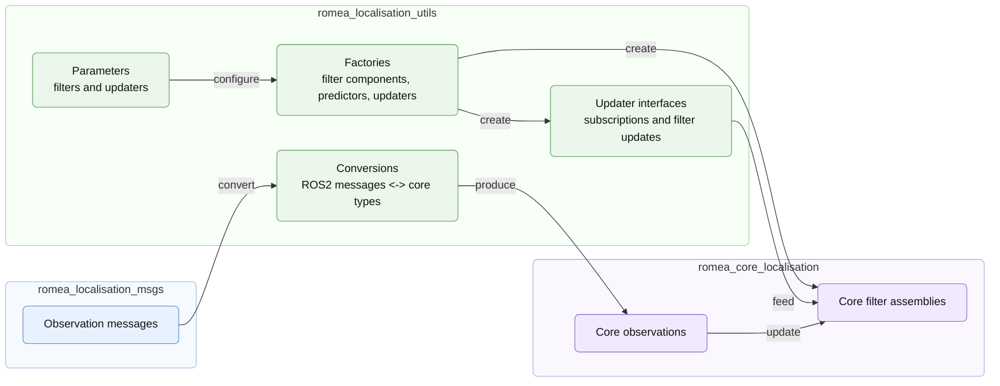

# romea_localisation_utils

`romea_localisation_utils` provides ROS2 helper APIs used to connect localisation plugin nodes and localisation core filters.

It is not a runtime node package. It contains C++ utilities for:

* converting between `romea_localisation_msgs` messages and `romea_core_localisation` observation types;
* declaring and reading common localisation filter and updater parameters;
* creating core filter assemblies from ROS2 parameters;
* creating localisation updater interfaces that subscribe to ROS2 observation topics and feed core localisation filters.

## 1) Role in the localisation stack

Localisation plugins publish typed observations as ROS2 messages. Localisation core nodes subscribe to these messages and fuse them with filters from `romea_core_localisation`. This package provides the reusable glue between both layers.



## 2) Message conversions

The `conversions/` headers convert localisation messages to and from the corresponding ROMEA core data structures.

| Header | Main purpose |
| ------ | ------------ |
| `observation_angular_speed_conversions.hpp` | Converts angular speed observations. |
| `observation_attitude_conversions.hpp` | Converts attitude observations. |
| `observation_course_conversions.hpp` | Converts course observations. |
| `observation_linear_speed_conversions.hpp` | Converts single linear speed observations. |
| `observation_linear_speeds_conversions.hpp` | Converts left/right linear speed observations. |
| `observation_pose_conversions.hpp` | Converts 2D pose observations. |
| `observation_position_conversions.hpp` | Converts 2D position observations. |
| `observation_range_conversions.hpp` | Converts range observations. |
| `observation_twist_conversions.hpp` | Converts 2D twist observations. |

All observation conversions preserve the observation timestamp, frame information and uncertainty carried by the message.

## 3) Localisation parameters

The `filter/parameters.hpp` API declares and reads the parameter groups shared by localisation filters and updater interfaces.

### 3.1) Filter and predictor parameters

| Parameter | Used by | Description |
| --------- | ------- | ----------- |
| `filter.state_pool_size` | Kalman and particle assemblies | Size of the internal filter state pool. |
| `filter.number_of_particles` | Particle assemblies | Number of particles used by particle filter implementations. |
| `predictor.maximal_dead_recknoning_travelled_distance` | Predictors | Maximum travelled distance allowed in dead-reckoning mode. |
| `predictor.maximal_dead_recknoning_elapsed_time` | Predictors | Maximum elapsed time allowed in dead-reckoning mode. |

### 3.2) Updater parameters

| Parameter | Used by | Description |
| --------- | ------- | ----------- |
| `<updater>.minimal_rate` | Proprioceptive and exteroceptive updaters | Minimal expected observation rate. A value of `0` disables the updater at node configuration level; constructed core updaters require a strictly positive rate. |
| `<updater>.trigger` | Exteroceptive updaters | Update trigger mode, either `always` or `once`. |
| `<updater>.mahalanobis_distance_rejection_threshold` | Exteroceptive updaters | Innovation rejection threshold used to discard outliers. |

## 4) Factories

The `filter/factory.hpp` API creates core localisation components from ROS2 node parameters.

| Factory function family | Creates |
| ----------------------- | ------- |
| `make_filter` | A Kalman or particle localisation filter wrapper configured with the selected predictor. |
| `make_predictor` | A predictor configured with dead-reckoning limits. |
| `make_proprioceptive_updater` | Updaters fed by proprioceptive observations such as twist or angular speed. |
| `make_exteroceptive_updater` | Updaters fed by exteroceptive observations such as position, pose or range. |
| `make_updater` | Selects the proprioceptive or exteroceptive updater factory from the updater inheritance. |

The factory layer is templated so that localisation nodes can select the core filtering engine, predictor and updater types through their traits while keeping the ROS2 parameter handling reusable.

## 5) Updater interfaces

`UpdaterInterface` subscribes to one ROS2 observation topic and forwards each received observation through a callback returned by the core localisation filter.

For each message:

1. the timestamp is extracted from the ROS2 message;
2. the message is converted to the corresponding core observation;
3. the stored update callback sends the observation to the core filter at the observation timestamp.

The `UpdaterInterfaces` manager stores interface builders while the core filter is configured, then creates the ROS2 subscriptions after the filter has been initialized.

## 6) Typical use

A localisation node usually combines the utilities in this order:

```cpp
declare_filter_parameters<core::FilterType::KALMAN>(node);
declare_predictor_parameters(node, 2.0, 10.0);

auto predictor = make_predictor<Predictor, core::FilterType::KALMAN>(node);
auto filter = make_filter<Filter, core::FilterType::KALMAN>(node, std::move(predictor));

auto updater = make_updater<UpdaterTwist, core::FilterType::KALMAN>(
  node, "twist_updater", make_topic_logger(node, "twist_updater"));
auto callback = filter->add_updater(std::move(updater));

filter->initialize();

UpdaterInterfaces updater_interfaces;
if (callback) {
  updater_interfaces.add<UpdaterInterfaceTwist>(
    "twist_updater", "twist", std::move(*callback));
}
updater_interfaces.create(node);
```

Concrete localisation core packages usually hide this boilerplate behind architecture-specific filter classes.

## License

This project is released under the Apache License 2.0. See the `LICENSE` file for details.

## Authors

This package was developed by **Jean Laneurit** in the context of the BaudetRob2 ANR project.
